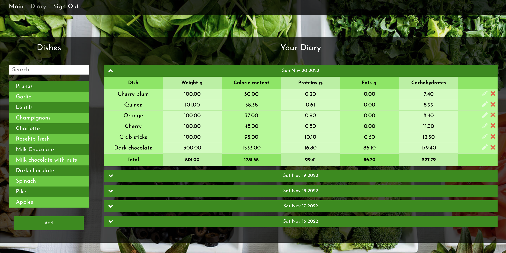

# Food Diary

A food diary is a daily log of what you eat and drink each day. The diary helps you and your doctor understand your eating habits. It can help you realize what you consume. Once you know this, you can make changes to your diet to improve your weight.

## Table of contents

- [Overview](#overview)
  - [Screenshot](#screenshot)
  - [Link](#link)
  - [Built with](#built-with)
- [Author](#author)

## Overview

### Screenshot

### Link

- Live Site URL: [chorniyigor.github.io/yapona](https://chorniyigor.github.io/yapona)

### Built with

- Semantic HTML5 markup
- CSS custom properties
- Flexbox
- CSS Grid
- Mobile-first workflow
- [React](https://reactjs.org/) - JS library

## Author

### Chorniy Igor

- [Website](https://igorc.site/)
- [Upwork Profile](https://www.upwork.com/freelancers/~01c5afe5dda1df0850)
